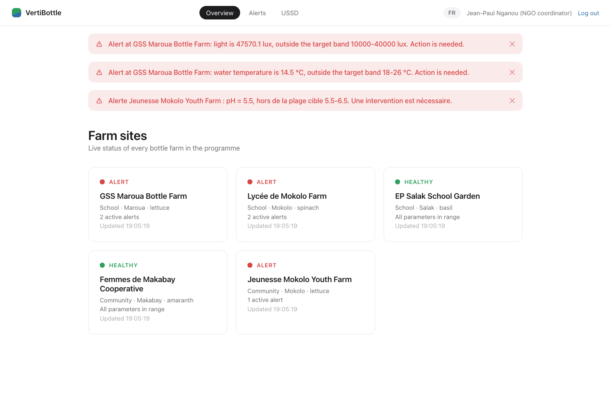
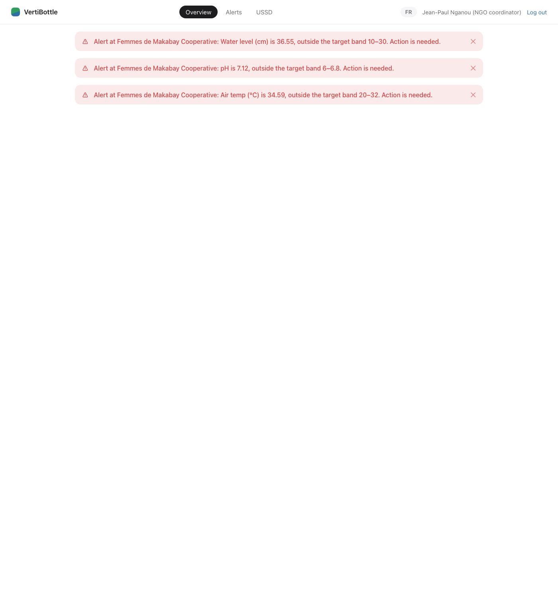
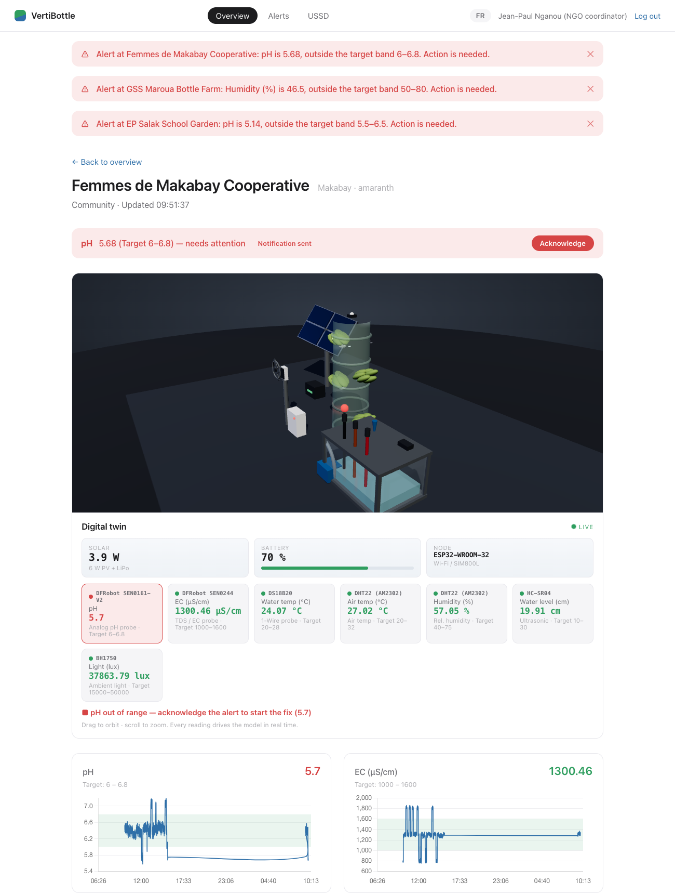
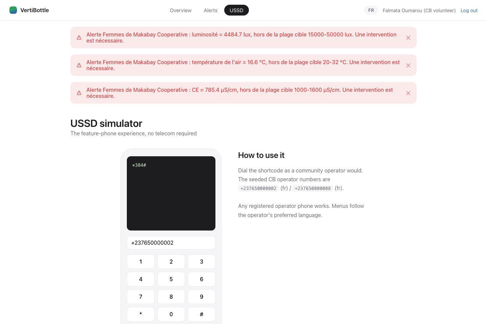

# VertiBottle


**A sensor-based monitoring system for hydroponic bottle farms in Cameroon's Far North region.**
Full-stack prototype (FastAPI + PostgreSQL + a live WebGL dashboard), built against the VertiBottle SRS.

| | |
|---|---|
| **Live demo** | **https://vertibottle.onrender.com** |
| **Quick access** | https://vertibottle.onrender.com/?auto=coordinator (skips login) |
| **Login** | any role chip on the login screen — all passwords are `demo1234` |
| **Source** | this repository (public) |
| **SRS document** | _paste your Google Drive link to the SRS here_ |

> On the free hosting tier the **first request can take ~50 seconds** to wake the server. Open the link once and wait, then it is fast. Keep a tab open during a demo — the dashboard polls every 30s, which keeps the server awake and the live data flowing.

---

## Contents

1. [What it is](#what-it-is)
2. [The problem, and why it matters](#the-problem-and-why-it-matters)
3. [The solution](#the-solution)
4. [Screenshots](#screenshots)
5. [What's implemented — features mapped to the SRS](#whats-implemented--features-mapped-to-the-srs)
6. [User roles and demo logins](#user-roles-and-demo-logins)
7. [Run it locally — step by step](#run-it-locally--step-by-step)
8. [Deploy your own public URL (free)](#deploy-your-own-public-url-free)
9. [How to use it (guided walkthrough)](#how-to-use-it-guided-walkthrough)
10. [Architecture](#architecture)
11. [Tech stack](#tech-stack)
12. [Tests](#tests)
13. [Project structure](#project-structure)
14. [Troubleshooting](#troubleshooting)

---

## What it is

VertiBottle is the digital layer for the **Bottle Farm** initiative, where discarded PET plastic bottles are recycled into vertical hydroponic columns that schools and community groups use to grow leafy vegetables (lettuce, spinach, amaranth, basil) where conventional farming isn't viable.

Each farm has a sensor node that continuously measures the **seven parameters that decide whether the crop lives**: pH, EC (nutrient strength), water temperature, air temperature, humidity, water level, and light. VertiBottle collects those readings, compares each one against the active crop's safe range, and when something drifts out of range it **alerts the right operator on a channel they actually have** — a web dashboard, email, SMS, or USSD for basic feature phones.

This build runs the **entire pipeline end to end**. Since the physical ESP32 hardware isn't available, the sensor nodes are simulated in software, so the full chain — sense → store → evaluate → alert → acknowledge → recover — is genuinely live, with data on the dashboard within seconds of launch.

## The problem, and why it matters

The Far North is the poorest region in Cameroon, with over 1.2 million people in acute food insecurity. Hydroponics can help, but it is unforgiving:

- If the nutrient pH drifts outside 5.5–6.5, or the water temperature climbs above 30 °C on a hot afternoon, a crop can fail within hours.
- The failure often isn't visible until the plants are already wilting, by which point it's too late.
- The people running these farms are **teachers and community volunteers, not agronomists**. At best they take an occasional manual reading with a handheld meter. They can't see a trend, can't be warned before a reading turns dangerous, and a programme manager can't compare farms across sites.

In short, the operators are flying blind, and the cost of a failed harvest falls on the families least able to absorb it. Existing commercial monitoring kits cost hundreds of dollars, need stable Wi-Fi, and are built for greenhouses in Europe, not a community farm on a shared feature phone. **That gap is what VertiBottle closes.**

## The solution

- **Continuous monitoring** of all seven parameters at every farm.
- A **rule engine** that raises a *Watch* on the first out-of-band reading (one reading could be sensor noise) and a full *Alert* on the second, then dispatches notifications.
- **Multi-channel notifications** so the message reaches the operator on whatever they use: dashboard banner, email, SMS, or a USSD menu on a basic phone (three key presses to acknowledge).
- A **web dashboard** with a live 3D digital twin, per-parameter charts, a multi-site overview for programme coordinators, and an append-only audit log.
- **Bilingual** (English / French) throughout, matching the region.

## Screenshots

**Multi-site overview** — one card per farm with a green / amber / red traffic-light status:



**Per-site dashboard** — a real-time 3D digital twin of the node (solar array, grow tower, nutrient reservoir, and the real sensor suite), with a live chart per parameter beneath it:



**The 3D digital twin, addressing an alert** — pH is out of range and flagged red; acknowledging it plays the physical corrective action (here, the doser) while the reading climbs back into its band:



**USSD simulator** — the feature-phone experience for community operators, no telecom account required:



## What's implemented — features mapped to the SRS

Every functional requirement (FR 1–8) and all five user classes from the SRS are implemented and demonstrable.

| SRS requirement | Where you see it |
|---|---|
| **FR 1 — Sensor data collection** (7 parameters, configurable interval, local buffering) | The simulator writes readings for every site continuously; charts and the twin update live. |
| **FR 2 — Data transport & storage** | Readings validated on ingest and stored in a time-series table (TimescaleDB-ready). |
| **FR 3 — Operator dashboard** (live chart per parameter, colour-coded status) | Per-site page: 7 charts with the target band shaded, plus the 3D twin and status badges. |
| **FR 4 — Rule engine & alerts** (Watch on 1st out-of-band, Alert on 2nd) | Watch → Alert Raised → Notification Sent, visible on the overview and site pages. |
| **FR 5 — Multi-channel notifications** (dashboard, email, SMS, USSD) | Dashboard banner is real; email/SMS/USSD are logged with exact content in the admin **Notification outbox**. |
| **FR 6 — USSD interface** (view readings, view/acknowledge alerts in ≤3 presses) | The USSD simulator page — dial, pick a menu item, acknowledge. |
| **FR 7 — Site & operator management** (register site, set crop & thresholds, assign operators) | Admin console: register a site, edit crop thresholds (tamper-logged), manage operators. |
| **FR 8 — Administration & audit** (append-only log, node health) | Admin console: append-only audit log and node-health view. |
| **Alert state machine** (Normal → Watch → Alert Raised → Notification Sent → Acknowledged → Resolved → Closed, plus the timeout shortcut) | Acknowledge an alert and follow it through resolution on the Alerts page. |
| **Bilingual UI** (EN / FR) | The `FR`/`EN` toggle in the header. |
| **Role-based access** for the five user classes | Log in as each role; the API enforces permissions, not just the UI. |

The five **actors / user classes**: School Operator, Community-Based (CB) Operator, Programme Coordinator, Agronomist, and Administrator — plus the external SMS / Email / USSD providers modelled as the notification outbox.

## User roles and demo logins

All passwords are **`demo1234`**. The login screen has a one-click chip for each role.

| Username | Role | What they can do |
|---|---|---|
| `school_op` | School Operator | View their site, acknowledge its alerts, dashboard + email channel |
| `cb_op` | Community (CB) Operator | View their site, acknowledge via USSD/SMS, French interface |
| `coordinator` | Programme Coordinator | See **all** sites, acknowledge and close alerts anywhere |
| `agronomist` | Agronomist / Researcher | Read-only dashboards + CSV export of readings |
| `admin` | Administrator | Everything: register sites, edit thresholds, manage operators, audit log, notification outbox |

## Run it locally — step by step

You need **Python 3.11+** and **PostgreSQL 14+**. No Node.js required (the frontend is plain HTML/JS with its libraries vendored in the repo).

### macOS (Postgres.app) — the one-command path

```bash
# 1. Install PostgreSQL: download Postgres.app from https://postgresapp.com,
#    open it, and click "Initialize".

# 2. Clone the repo and enter it
git clone https://github.com/NkemJefersonAchia/VertiBottle.git
cd VertiBottle

# 3. Run it. The script creates the virtualenv, installs dependencies,
#    creates the database, applies migrations, and seeds demo data.
./run.sh
```

Then open **http://127.0.0.1:8000**. That's it. Interactive API docs are at http://127.0.0.1:8000/docs.

### Linux / Windows (WSL) / any machine — explicit steps

```bash
# 1. Make sure PostgreSQL is running, then create the database:
createdb vertibottle
#    (or:  psql -U postgres -c "CREATE DATABASE vertibottle;")

# 2. Clone and enter the repo
git clone https://github.com/NkemJefersonAchia/VertiBottle.git
cd VertiBottle

# 3. Create a virtualenv and install dependencies
python3 -m venv .venv
.venv/bin/pip install -r requirements.txt

# 4. Point the app at your database (adjust user/password/host as needed).
#    Leave it unset on macOS/Postgres.app and it auto-detects your account.
export DATABASE_URL="postgresql://<user>:<password>@localhost:5432/vertibottle"

# 5. Start the server (from the backend/ folder)
cd backend
../.venv/bin/python -m uvicorn app.main:app --host 127.0.0.1 --port 8000
```

Open **http://127.0.0.1:8000**. On first launch the app creates its tables and seeds the 5 pilot sites, 4 crop profiles, and demo users automatically — nothing else to run.

**Re-seed from scratch** at any time by dropping and recreating the database, then restarting (`dropdb vertibottle && createdb vertibottle`).

## Deploy your own public URL (free)

The repo includes a **Render Blueprint** (`render.yaml`) — no Docker, no credit card.

1. Sign in at **https://render.com** with GitHub.
2. **New +  →  Blueprint** → select this repository → **Apply**.
3. Render reads `render.yaml`, provisions a free PostgreSQL database and a free web service, and wires `DATABASE_URL` between them.
4. Wait for the first build (2–4 min). Your public URL appears at the top of the service page (e.g. `https://vertibottle.onrender.com`).
5. Verify: open `https://<your-app>.onrender.com/api/v1/status` — it returns `{"ok": true, ...}`.

The app creates its own schema and seeds demo data on boot, so there is no migration or seeding step. Everything hosting-specific — the start command (`Procfile`), the `DATABASE_URL` driver/TLS normalisation, and `requirements-prod.txt` (adds `psycopg` for Linux) — is already handled in code. Free web services sleep after 15 min idle and wake in ~50 s on the next request.

*(The same `Procfile` also works on Railway, Fly.io, and similar hosts.)*

## How to use it (guided walkthrough)

A fuller click-by-click script is in [docs/DEMO.md](docs/DEMO.md). The short version:

1. **Log in** as `coordinator` (or use `?auto=coordinator`). You land on the **multi-site overview** — five farms with traffic-light status.
2. **Open a site.** The **3D digital twin** loads at the top: drag to orbit, scroll to zoom. Every part is driven by live data. Below it, a live chart per parameter with the healthy band shaded green, and the instrument HUD listing each real sensor (DS18B20, DHT22, DFRobot pH/TDS, HC-SR04, BH1750) with its value.
3. **Watch an alert fire.** When a reading drifts out of band the site turns amber (*Watch*), then red (*Alert*) on the second reading, and a **banner** appears.
4. **Acknowledge it.** Click **Acknowledge** on the ribbon. The corrective action plays in the twin (misting, dosing, fan, shade…) and the reading actually climbs back into its band. Ignore it instead and the problem stays broken — the simulation is tied to the alert lifecycle, not a timer.
5. **See the other channels.** Log in as `admin` → **Notification outbox** shows the exact email / SMS / USSD messages that would have been sent, in the operator's language.
6. **Try the feature phone.** Open the **USSD** page, dial as a community operator, and acknowledge an alert in three presses.
7. **Admin & audit.** As `admin`: register a site, edit a crop threshold (watch it appear in the audit log with old → new values), review node health.
8. **Switch language** with the `FR` / `EN` toggle at any time.

## Architecture

One reading travels: **simulated sensor node → ingestion → rule engine → notification dispatcher → dashboard → operator acknowledgement → audit**. Each stage maps to one backend module, so every requirement is traceable to a file. The full 11-step data flow, the class model, and the alert state machine (with the places the code diverges from the SRS and why) are documented in **[docs/ARCHITECTURE.md](docs/ARCHITECTURE.md)**.

Other docs:
- **[docs/API.md](docs/API.md)** — every REST endpoint, who may call it.
- **[docs/CONFIG.md](docs/CONFIG.md)** — every setting and its default.
- **[docs/TESTING.md](docs/TESTING.md)** — the test strategy (grey-box, seven ISTQB principles).
- **[docs/DEMO.md](docs/DEMO.md)** — the demo walkthrough.

## Tech stack

- **Backend:** FastAPI (Python), SQLAlchemy, Alembic migrations.
- **Database:** PostgreSQL, with the readings table designed as a TimescaleDB hypertable (falls back to a plain indexed table automatically if the extension isn't present — `GET /api/v1/status` reports which mode is active).
- **Frontend:** plain HTML / CSS / JavaScript, buildless. Charts via Chart.js; the 3D digital twin via Three.js (WebGL). Both libraries are vendored in `frontend/vendor/` — no CDN, no npm.
- **Simulation:** an in-process background task stands in for the ESP32 field nodes.
- **Responsive:** works on phone, tablet and desktop.

## Tests

```bash
cd backend && ../.venv/bin/python -m pytest tests -q                     # 140 tests
cd backend && ../.venv/bin/python -m pytest tests --cov=app --cov-branch # + coverage (95%)
```

140 automated tests across three layers (unit, API, one end-to-end scenario), 95% branch coverage, gated at 90% in GitHub Actions on every push. See [docs/TESTING.md](docs/TESTING.md).

## Project structure

```
run.sh                  one-command local launcher
render.yaml             Render Blueprint (free public deploy)
Procfile                start command for Railway / Heroku-style hosts
requirements.txt        Python dependencies (local, pg8000 driver)
requirements-prod.txt   adds psycopg for Linux production hosts
backend/
  app/
    main.py             FastAPI app: startup, seeding, static file serving
    config.py           settings + DATABASE_URL normalisation (docs/CONFIG.md)
    database.py         engine + TimescaleDB detection/fallback
    models.py           SQLAlchemy models (SRS class diagram)
    schemas.py          request/response shapes
    security.py         login tokens + role-based access control
    seed.py             5 pilot sites, 4 crops, demo users
    simulator.py        the software "sensor nodes" + timeout sweeper
    rule_engine.py      band checking, Watch → Alert escalation
    state_machine.py    legal alert lifecycle transitions
    notifier.py         multi-channel dispatch (banner real, rest simulated)
    audit.py            append-only audit writes
    routers/            one file per API area (auth, sites, readings,
                        alerts, notifications, ussd, admin)
  tests/                140-test suite (unit, API, end-to-end)
frontend/
  index.html            single page, all views
  app.js                routing, charts, USSD phone, admin console, i18n
  farm3d.js             the 3D digital twin (Three.js / WebGL)
  styles.css            design tokens, layout, responsive rules
  vendor/               Chart.js and Three.js (vendored, no CDN)
docs/                   ARCHITECTURE, API, CONFIG, DEMO, TESTING
.github/workflows/      CI: full test suite + coverage gate on every push
```

## Troubleshooting

**The live URL is slow / blank on first load** — free-tier cold start. Wait ~50 s and refresh. Keep a tab open so it stays awake.

**"Connection refused" locally** — PostgreSQL isn't running. Start Postgres.app (macOS) or your `postgres` service, then re-run. `run.sh` tries to start Postgres.app for you.

**Port 8000 already in use** — stop the other process (`lsof -ti:8000 | xargs kill`) or run on another port: `PORT=8010 ./run.sh`.

**`role "..." does not exist`** — your PostgreSQL superuser doesn't match your OS username. Set the URL explicitly: `export DATABASE_URL="postgresql://<user>:<password>@localhost:5432/vertibottle"`.

**Dashboard is empty / no alerts** — the simulator writes only while the server is running; give it ~10 s after startup. To make alerts fire faster during a demo, restart with `SIM_DRIFT_PROBABILITY=0.02 ./run.sh`.

**Login stops working after a database reset** — your browser holds a token for a user that no longer exists. Log out (or clear the site's localStorage) and log in again.
