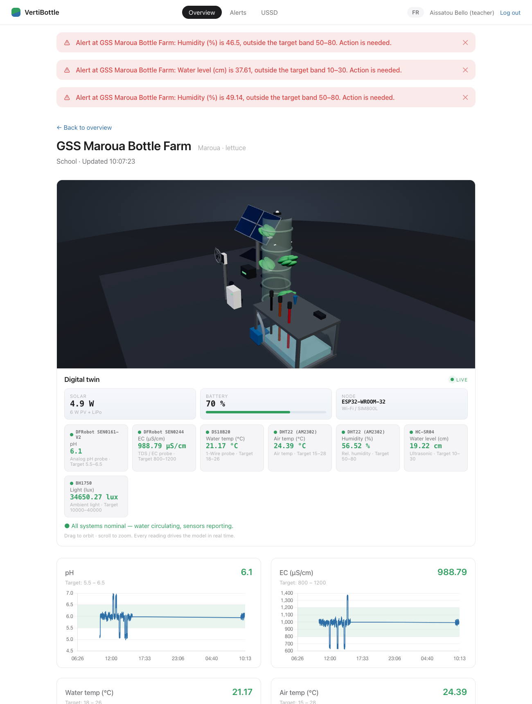

# VertiBottle


VertiBottle is a monitoring system for hydroponic bottle farms: vertical grow columns made from recycled PET bottles, run by schools and community groups in Cameroon's Far North region. Sensors track the seven parameters that decide whether the crop lives (pH, EC, water temperature, air temperature, humidity, water level, light), and the system tells the right operator, on a channel they actually have, when something drifts out of the crop's safe range. This build is the full pipeline running end to end with the hardware layer simulated in software, so there is live data on the dashboard within seconds of launching.


Each site page opens with a **3D digital twin**: a real-time WebGL model
of the physical node — solar array and battery, the recycled-bottle grow
tower, the caged nutrient reservoir, pump, and the actual sensor suite from
the bill of materials (DS18B20, DHT22, DFRobot pH/TDS probes, HC-SR04
ultrasonic, BH1750). Every reading drives the model live: the sun brightens
and the panels feed the battery with the light reading, the reservoir fills
and tints with water level and nutrient strength, thermometers and mist
track temperature and humidity. Drag to orbit, scroll to zoom. The
instrument HUD below reads out each sensor with its model number, live
value and target band.

When a parameter drifts out of range its subsystem pulses; acknowledge the
alert and you watch the physical corrective action play — a misting head,
a pH/nutrient doser, the reservoir refill, a ventilation fan, a shade
panel — while the value actually climbs back into its target band. Ignore
an alert and the problem stays broken: the simulation is coupled to the
alert lifecycle, not a timer.

Below: pH is out of range, its probe flagged red in both the 3D model and
the HUD, with the caption prompting an acknowledgement to start the fix.


With nothing wrong, the twin simply runs — every sensor green, water
circulating, the farm alive.



## Prerequisites

| Requirement | Version | Notes |
|---|---|---|
| Python | 3.11+ (tested on 3.14) | `python3 --version` |
| PostgreSQL | 14+ (tested on 18 via Postgres.app) | TimescaleDB optional, see below |
| A modern browser | any | Chart.js does the drawing |

No Node.js is required. The frontend is plain HTML/JS; its only dependency (Chart.js) is vendored in `frontend/vendor/`.

TimescaleDB: the readings table is designed as a hypertable, and the app tries `CREATE EXTENSION timescaledb` on startup. If the extension isn't installed (it isn't in Postgres.app), it falls back to a plain indexed table automatically. Nothing to configure either way. `GET /api/v1/status` tells you which mode you're in.

## Setup from a clean machine (macOS)

```bash
# 1. PostgreSQL — install Postgres.app from https://postgresapp.com, open it,
#    click "Initialize". (Or: brew install postgresql@16 && brew services start postgresql@16)

# 2. Get the code
cd ~/Documents/VertiBottle   # or wherever you cloned it

# 3. Run it. First run creates the venv, installs dependencies,
#    creates the database, applies migrations, seeds demo data.
./run.sh
```

Then open **http://127.0.0.1:8000**. That's it — one command. The API docs are at http://127.0.0.1:8000/docs.

Manual equivalent, if you prefer to see each step:

```bash
python3 -m venv .venv
.venv/bin/pip install -r requirements.txt
/Applications/Postgres.app/Contents/Versions/latest/bin/createdb vertibottle
cd backend
../.venv/bin/alembic upgrade head
../.venv/bin/uvicorn app.main:app --port 8000
```

## Seeding

Seeding is automatic: on startup, if the database has no sites, the app inserts the 5 pilot sites (3 school, 2 community), the 4 crop profiles (lettuce, spinach, amaranth, basil) and the demo users below. To re-seed from scratch:

```bash
/Applications/Postgres.app/Contents/Versions/latest/bin/dropdb vertibottle
./run.sh   # recreates, migrates, reseeds
```

## Demo logins

All passwords are `demo1234`. The login screen also has one-click role chips.

| Username | Role | What they see |
|---|---|---|
| `school_op` | School operator | GSS Maroua site, dashboard + email alerts |
| `cb_op` | Community operator | Makabay cooperative, USSD/SMS (French) |
| `coordinator` | Programme coordinator | All sites, can acknowledge and close alerts |
| `agronomist` | Agronomist / researcher | Read-only + CSV export |
| `admin` | Administrator | Everything: site registration, operators, audit log, notification outbox |

Tip: `http://127.0.0.1:8000/?auto=coordinator` auto-logs-in for kiosk/projector
use, and `&lang=fr` forces the interface language (handy for screenshots).

## Project structure

```
run.sh                  one-command launcher
requirements.txt        Python dependencies
backend/
  alembic/              database migrations
  app/
    main.py             FastAPI app: startup, seeding, static file serving
    config.py           all settings (env-overridable, see docs/CONFIG.md)
    database.py         engine + TimescaleDB detection/fallback
    models.py           SQLAlchemy models (SRS class diagram)
    schemas.py          pydantic request/response shapes
    security.py         login tokens + role-based access control
    seed.py             5 pilot sites, 4 crops, demo users
    simulator.py        the software "sensor nodes" + timeout sweeper
    rule_engine.py      band checking, Watch → Alert escalation
    state_machine.py    legal alert lifecycle transitions
    notifier.py         multi-channel dispatch (banner real, rest simulated)
    audit.py            append-only audit writes
    routers/            one file per API area (auth, sites, readings,
                        alerts, notifications, ussd, admin)
  tests/                139-test suite (unit, API, end-to-end) — docs/TESTING.md
frontend/
  index.html            single page, all views
  app.js                routing, charts, USSD phone, admin console, i18n
  farm3d.js             3D digital-twin renderer (Three.js / WebGL)
  vendor/three.module.min.js  Three.js r160 (vendored, no CDN needed)
  styles.css            design tokens and layout
  vendor/chart.umd.js   Chart.js 4 (vendored, no CDN needed)
docs/
  ARCHITECTURE.md       the 11-step data flow mapped to actual modules
  API.md                every endpoint, with who may call it
  CONFIG.md             every setting and its default
  DEMO.md               a click-by-click demo walkthrough
  TESTING.md            test strategy: grey-box rationale, seven principles
.github/workflows/
  ci.yml                full suite + coverage gate on every push
```

Why this shape: the backend modules mirror the SRS component boundaries (ingestion, rule engine, dispatcher, presentation), which keeps each FR traceable to one file. The frontend is deliberately buildless — no bundler, no Node — because the SRS specifies vanilla HTML/JS + Chart.js and the demo must run anywhere.

## Running the tests

```bash
cd backend && ../.venv/bin/python -m pytest tests -q                     # 139 tests
cd backend && ../.venv/bin/python -m pytest tests --cov=app --cov-branch # + coverage (95%)
```

CI runs the suite on every push (see `.github/workflows/ci.yml`). The
strategy — what's white-box vs black-box, and how the suite applies the
seven testing principles — is in [docs/TESTING.md](docs/TESTING.md).

## Troubleshooting

**"Connection refused" / `pg_isready` fails** — PostgreSQL isn't running. Open Postgres.app (or `brew services start postgresql@16`). `run.sh` tries to start Postgres.app for you.

**Port 8000 already in use** — something else owns the port. Either stop it (`lsof -ti:8000 | xargs kill`) or run on another port: `PORT=8010 ./run.sh`.

**`role "..." does not exist`** — your PostgreSQL superuser doesn't match your macOS username (common with Homebrew installs). Set the URL explicitly:
`DATABASE_URL="postgresql+pg8000://<pguser>:<password>@localhost:5432/vertibottle" ./run.sh`

**"database vertibottle does not exist"** — `run.sh` creates it when it can find `createdb`; on a non-Postgres.app install run `createdb vertibottle` once.

**TimescaleDB warnings / want the real hypertable** — install the extension (`brew install timescaledb` + follow its setup), then restart the app; it converts the readings table automatically (`migrate_data => TRUE`).

**Dashboard is empty** — the simulator only writes while the backend runs. Give it ~10 seconds after startup; check `GET /api/v1/status` returns `{"ok": true}`.

**Charts flat / no alerts firing during a demo** — alert pacing is tunable. `SIM_DRIFT_PROBABILITY=0.02 ./run.sh` makes drifts frequent; the default 0.005 is calm.

**Login stops working after a database reset** — your browser holds a token for a user that no longer exists. Log out (or clear localStorage for the site) and log back in.
